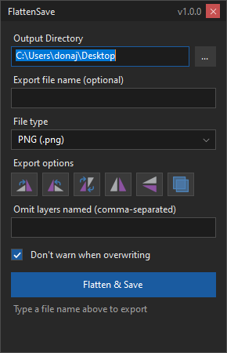

# FlattenSave for Paint.NET

A floating dark-themed panel for Paint.NET 5.x that flattens the open image and saves it to a folder in one click.

- Output directory (paste or browse), file name (falls back to the open file's name), file type dropdown
- Rotate 90 / -90 / 180, mirror horizontal / vertical, omit layers by name
- Optional "don't warn when overwriting"

## Install
Download `FlattenSave.dll` from `docs/FlattenSave.zip`, copy it to `Documents\paint.net App Files\Effects\`, restart Paint.NET. Reopen the panel from Effects > Tools > FlattenSave Panel.

## Build
`dotnet build -c Release` (needs the .NET 9 SDK and Paint.NET installed at `C:\Program Files\paint.net`).

